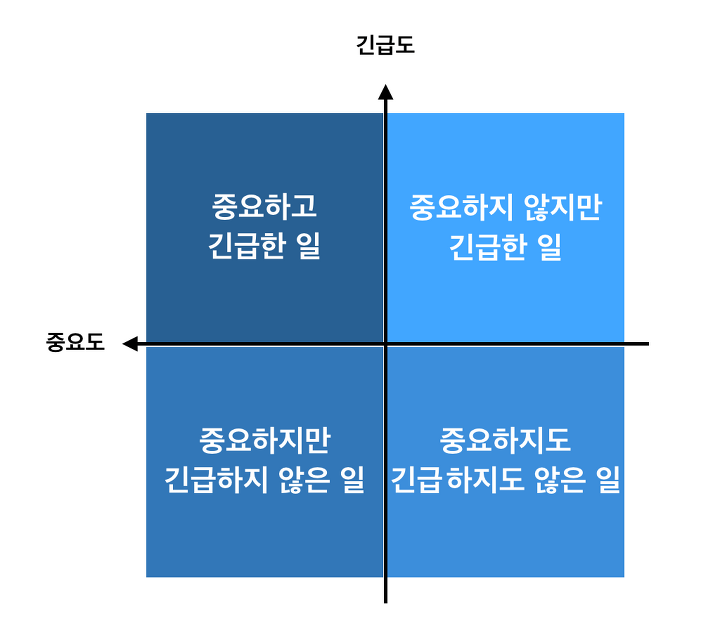

# Clean Architecture

> 빨리 가능 유일한 방법은 제대로 가는 것이다.
>
> - 로버트 C. 마틴
>
> 아키텍처는 구현과 측정을 통해 증명해야 하는 가설이다.
>
> - 톰 길브
>
> 아키텍처란 프로젝트 초기에 제대로 정할 수 있기를 바라는 결정사항이지만, 
>
> 제대로 정할 가능성이 그 외 사항들보다 반드시 더 높지는 않다.
>
> - 랄프 존슨

## 01 소개

### 1장 설계 design와 아키텍처 architecture란?

어떠한 차이도 없다. 소프트웨어 아키텍처의 목표는 필요한 시스템을 만들고 유지보수하는데 투입되는 인력을 최소화하는 것이다. 비용을 최소화하고 생산성을 최대화하기 위해서는 소프트웨어 아키텍처를 초기에 잘 설계해야한다. 아키텍처를 잘 설계하기 위한 속성은 다음 장부터이다.

### 2장 두 가지 가치에 대한 이야기

소프트웨어 시스템은 행위 behavior와 구조 structure 라는 가치를 개발자에게 제공한다. 개발자는 이 두 가치를 최대한 높게 유지해야한다. behavior 는 기능 명세서, 요구사항 문서를 구체화하는 작업이다. 

structure라는 가치는 소프트웨어와 연관되어 있다. 소프트웨어가 목적을 추구하려면 변경사황에 유연해야 한다. 변경사항의 어려움은 범위에 비례해야 하고 형태와는 관련이 없어야 한다. 변경사항 크기는 개발비용에 비례한다. 아키텍처는 고정적이어서는 안되며 독립적이고 유연해야 하며 이는 아키텍처를 더 실용적으로 만든다

소프트웨어 시스템에서 아키텍처가 기능보다 더 중요하다

- [아이젠하워 매트릭스](https://brunch.co.kr/@edoodt/30)

behavior 는 긴급하지만 매번 중요하지 않다. 그리고 structure 는 중요하지만 긴급하지 않다.

아이젠하워 매트릭스의 우선순위는 아래와 같다.

1. 중요하고 긴급한 일
2. 중요하지만 긴급하지 않은 일
3. 중요하지 않지만 긴급한 일
4. 중요하지도 긴급하지도 않은 일

behavior는 첫번째, 세번째 우선순위에 있으며 이 우선순위를 혼동해 두번재 우선순위에 있는 structure를 무시하는 경우가 있다. 

**<u>소프트웨어 개발자를 고용하는 이유는 이 딜레마를 해결하기 위함이고 기능의 긴급성보다 아키텍처의 중요성을 설득하는 일을 해야한다.</u>**

> 아키텍처가 후순위가 되면 시스템을 개발하는 비용이 더 많이 들고, 일부 또는 전체 시스템에 변경을 가하는 일이 현실적으로 불가능해진다.
