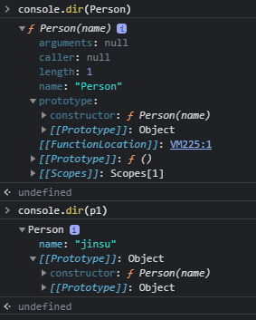

# Inside Javascript

##  Chapter04 함수와 프로토타입 체이닝

### 프로토타입 체이닝

#### 프로토타입의 두가지 의미

- 자바스크립트는 프로토타입 기반 객체지향 프로그래밍을 지원한다
- 자바스크립트에는 자바와 같은 클래스 개념이 없다
- **<u>객체 리터럴이나 생성자 함수로 객체를 생성하며 해당 객체의 부모 객체가 프로토타입 객체이다</u>**

- 상속과 마찬가지로 자식 객체는 부모 객체가 가진 프로퍼티 접근이나 메서드를 상속받아 호출할 수 있다
- 자바스크립트 모든 객체는 자신의 부모인 프로토타입 객체를 가리키는 링크 형태의 프로퍼티가 있으며 이를 **암묵적 프로토타입 링크 implicit prototype link**라고 한다. 그리고 [[Prototype]] 에 저장한다

- 함수 객체의 prototype 프로퍼티와 객체의 [[Prototype]]을 구분해야 한다

  > 자바스크립트에서 모든 객체는 자신을 생성한 생성자 함수의 prototype 프로퍼티가 가리키는 프로토타입 객체를 자신의 부모 객체로 설정하는 [[Prototype]] 링크로 연결한다 

- 자바스크립트에서 객체를 생성하는 건 생성자 함수의 역할이지만 생성된 객체의 실제 부모 역할을 하는건 생성자의  prototype 프로퍼티가 가리키는 프로토타입 객체이다




---

#### 객체 리터럴 방식으로 생성된 객체의 포로토타입 체이닝

- 객체 리터럴로 생성한 객체는 Object() 라는 내장 생성자 함수로 생성된다

- 자바스크립트 규칙으로 생성한 객체 리터럴 형태의 인스턴스는 Object() 함수의 프로퍼티가 가리키는 Object.prototype 객체를 자신의 프로토타입 객체로 연결한다.

- 프로토타입 체이닝 => **<u>자바스크립트는 특정 객체의 프로퍼티나 메서드에 접근할 때 프로퍼티나 메서드가 없다면 [[Prototype]] 링크를 따라 부모 역할을 하는 프로토타입 객체의 프로퍼티를 차례대로 검색한다</u>**

  

---

#### 생성자 함수로 생성된 객체의 프로토타입 체이닝

> 자바스크립트에서 모든 객체는 자신을 생성한 생성자 함수의 prototype 프로퍼티가 가리키는 객체를 자신의 프로토타입 객체(부모 객체)로 취급한다


---

#### 프로토타입 체이닝의 종점

- Object.prototype 객체는 프로토타입 체이닝의 종점이다
- 객체 생성 방식과 관계없이 모든 자바스크립트 객체는 프로토타입 체이닝으로 Object.prototype 객체가 가진 프로퍼티와 메서드에 접근한다

---

#### 기본 데이터 타입 확장

- 숫자, 문자열, 배열 등에서 사용되는 표준 메서드는 **Number.prototype, String.prototype, Array.prototype** 등에 정의된다

- 기본 내장 프로토타입 객체도 Object.prototype을 프로토타입으로 가진다

---

#### 프로토타입도 자바스크립트 객체이다

- 함수 생성시 자신의  prototype 프로퍼티에 연결되는 프로토타입 객체는 default 로 constructor 프로퍼티만 가지는 객체이다
- 프로토타입 객체 역시 자바스크립트 객체이다

---

#### 프로토타입 메서드와 this 바인딩

- 메서드 호출 패턴에서의 this는 그 메서드를 호출한 객체에 바인딩된다

  ```js
  function Person(name) {
      this.name = name
  }
  
  Person.prototype.getName = function() {
      return this.name
  }
  
  const p1 = new Person('jinsu')
  p1.getName() // jinsu
  
  Person.prototype.name = 'person'
  Person.prototype.getName() // person
  ```

---

#### 디폴트 프로토타입은 다른 객체로 변경이 가능하다

- 디폴트 프로토타입 객체를 다른 일반 객체로 변경하는 것이 가능하다

- 이러한 특징을 이용하여 객체지향의 상속을 구현한다

  ```js
  function Person(name){
      this.name = name
  }
  console.log(Person.prototype.constructor)
  /*
  ƒ Person(name){
      this.name = name
  }
  */
  const p1 = new Person('jinsu')
  console.log(p1.country)
  // undefined
  Person.prototype = {
      country: 'South Korea'
  }
  console.log(Person.prototype.constructor)
  // Object() { [native code] }
  const p2 = new Person('wanhee')
  console.log(p2.country)
  // South Korea
  console.log(p1.constructor)
  /*
  ƒ Person(name){
      this.name = name
  }
  */
  console.log(p2.constructor)
  // Object() { [native code] }
  ```

---

#### 객체의 프로퍼티 읽기나 메서드를 실행할 때만 프로토타입 체이닝이 동작한다

- 객체에 있는 특정 프로퍼트에 값을 쓰려고 하면 프로토타입 체이닝이 일어나지 않는다

  ```js
  function Person(name){
      this.name = name
  }
  
  Person.prototype.country = 'Korea'
  const p1 = new Person('jinsu')
  const p2 = new Person('wanhee')
  
  console.log(p1.country) // Korea
  
  p1.country = 'Ukraine'
  console.log(p1.country) // Ukraine
  console.log(p2.country) // Korea
  ```

  

