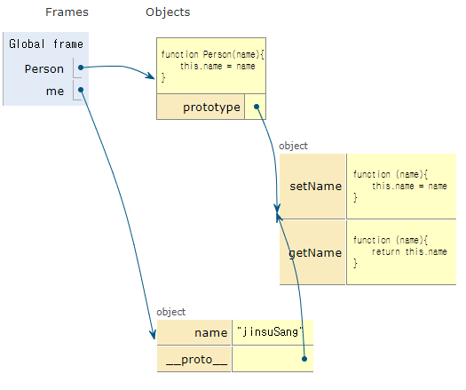
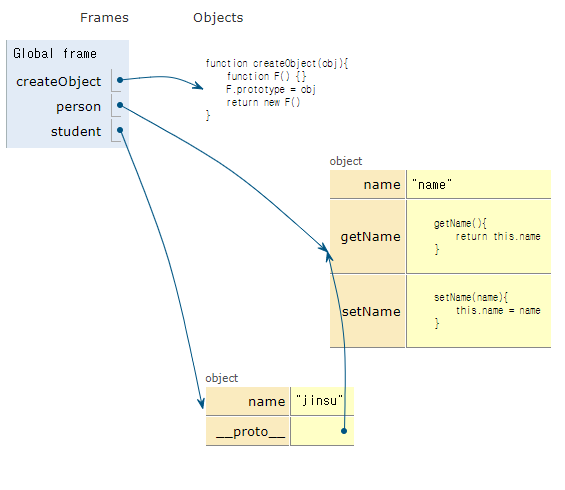
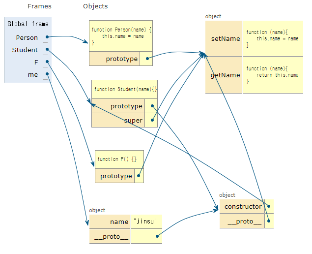

# Inside Javascript

##  Chapter06 객체지향 프로그래밍

- 인스턴스는 부모 객체의 prototype 체인으로 함수를 참조한다

- 더글라스 크락포드의 메서드 정의 방법

  ```js
  Function.prototype.method = function(name, func){
      if(!this.prototype[name]){
          this.prototype[name] = func 
      }
  }
  ```

- 클래스, 생성자, 메서드

  ```js
  Function.prototype.method = function(name, func){
      if(!this.prototype[name]){
          this.prototype[name] = func 
      }
  }
  
  function Person(name){
      this.name = name
  }
  
  Person.method('setName', function(name){
      this.name = name
  })
  
  Person.method('getName', function(name){
      return this.name
  })
  
  const me = new Person('jinsuSang')
  console.log(me.getName())
  ```

  

## 상속

- 객체 프로토타입 체인을 이용하여 상속을 구현한다
  - Prototypal inheritance 프로토타입을 이용한 상속
  - class 기반 상속

### 프로토타입을 이용한 상속

```js
function createObject(obj){
    function F() {}
    F.prototype = obj
    return new F()
}
```

```js
const person = {
    name: 'name',
    getName(){
        return this.name
    },
    setName(name){
        this.name = name
    }
}

function createObject(obj){
    function F() {}
    F.prototype = obj
    return new F()
}

const student = createObject(person)
student.setName('jinsu')
console.log(student.getName())
```




- 자식 클래스 확장
```js
function extend(obj, prop){
    if(!prop){
        prop = obj
        obj = this
    }
    for(const i in prop){
        obj[i] = prop[i]
    }
    return obj
}
```

## 클래스 기반의 상속

```js
Function.prototype.method = function(name, func){
    if(!this.prototype[name]){
        this.prototype[name] = func 
    }
}

function Person(name) {
    this.name = name
}

Person.prototype.setName = function(name){
    this.name = name
}

Person.prototype.getName = function(name){
    return this.name
}

function Student(name){}

function F() {}
F.prototype = Person.prototype
Student.prototype = new F()
Student.prototype.constructor = Student
Student.super = Person.prototype

const me = new Student()
me.setName('jinsu')
console.log(me.getName())
```



### 즉시 실행 함수와 클로저 활용한 상속 함수

```js
const inherit = function(Parent, Child){
    let F = function() {}
    return function(Parent, Child){
        F.prototype = Parent.prototype
		Child.prototype = new F()
        Child.prototype.constructor = Child
        Child.super = Parent.prototype
    }
}
```

