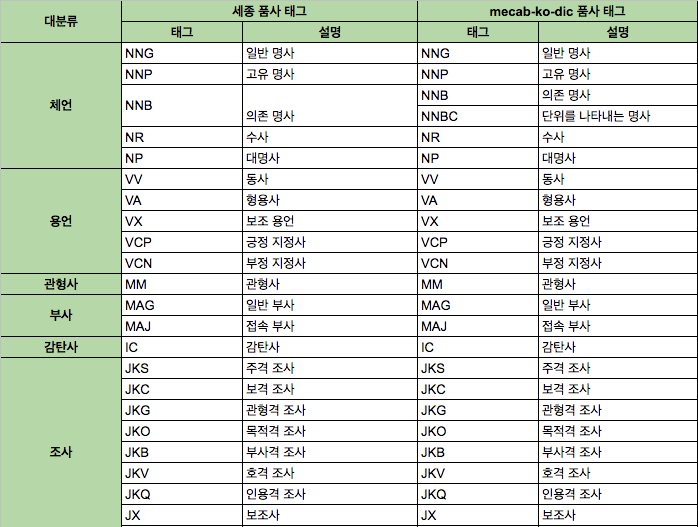

# 자연어 처리 바이블

## 텍스트의 전처리

### 4.1 비정형 데이터 내의 오류

- 비정형 데이터란 일정한 규격이나 형태를 지닌 숫자 데이터와 달리 그림, 영상, 문서처럼 형태와 구조가 다른 구조화 되지 않은 데이터를 가리킨다 
- 음성정보, 도영상정보, 시각정보

| 정형 데이터                                       | 비정형 데이터                                              |
| ------------------------------------------------- | ---------------------------------------------------------- |
| 테이블 관계형 데이터 형식으로 표시                | 테이블 관계형 데이터 형식으로 표시 불가능                  |
| 숫자, 날짜, JSON 등의 파일 형식                   | 시각 정보, 음성정보, raw 텍스트                            |
| 전체 데이터의 약 20%                              | 전체 데이터의 약 80%                                       |
| 차지하는 용량이 비교적 작다                       | 차지하는 용량이 비교적 많다                                |
| 전통적인 방법을 이용한 데이터 수정 및 사용이 용이 | 전통적인 방법을 이용한 데이터 수정 및 사용에 용이하지 않음 |

- 비정형 데이터는 불규칙성, 모호성 때문에 정의를 내리고 이해하기가 어렵다

### 4.2 텍스트 문서의 변환

- 전처리 첫 번째 단계는 목적된 파일로푸터 텍스트를 추출하는 것이다 

### 4.3 띄어쓰기 교정 방법

- 띄어쓰기가 사용되는 여러 언어에서 띄어쓰기의 중요성은 단어의 의미 분할 및 전달과 함게 매우 중요하다 
- 한국어는 크게 의미 준절과 가독성 및 의미혼용 방지의 의미를 가진다 
  1. 각 단어 및 조사간 구분을 명화갛게 해줌으로써 더 간편한 프로세싱이 가능하게 해준다
  2. 문맥상 의미 파악에 대한 부담을 덜어주는 방식이다

- 한국어는 형태소 분석이나 구문 분석과 같은 언어처리는 입력 분장이 어절 단위로 띄어쓰기가 잘 되어있음을 전제로 연구가 진행되었다
- 그러나 실생활에서는 띄어쓰기가 제대로 되어있지 않은 경우가 많다 
- 이점은 중요한데 한국어는 띄어쓰기의 위치에 따라 텍스트의 의미가 달라지기 때문이다

#### 4.3.1 규칙 기반 띄어쓰기 교정 기법

- 한국어 자동 띄어쓰기에 대한 기존 연구는 형태소 분석기를 사용한 규칙기반 분석 방법이 존재한다 
- 규칙은 어휘지식, 규칙, 오류 유형 등 휴리스틱 규칙을 이용한다 
- 규칙 기반 방법은 형태소 분석기를 포함해 여러 언어학적 자원을 만들어야 한다 
- 이에 복잡한 단계의 휴리스틱을 적용해야 하기 때문에 비교적 분석과정이 복잡하고 어휘 지식 구축관리에 비용이 크다 
- 시스템의 유지 및 보수가 어려워진다 
- 장점으로는 높은 정확도를 보여준다 
- 하지만 규칙기반 방법의 한계는 모든 상황에 적용되는 모든 경우의 규칙을 모두 만들지 못한다는 것이다 

#### 4.3.2 통계 확률 기반 띄어쓰기 교정 기법

- 말뭉치로부터 자동 추출된 음절 n-gram 정보를 기반으로 기계적인 계산 과정을 거쳐 띄어스기 오류를 교정하므로 구현이 더 용이해졌다 
- 어휘 지식 구축 관리 및 미등록어에 대해서도 분석이 가능하다 
- 하지만 학습 말뭉치의 영향을 크게 받으며 정확도 및 오류율이 높은 경우가 많다 
- 이를 해결하기 위해 더 크고 잘 정제된 학습 데이터가 필요하다 

### 4.4 철자 및 맞춤법 교정방법

- 철자 교정은 정확한 의미전송 및 정보교환을 위해 반드시 필요하다 
- 띄어쓰기 교정의 연장선과 유사한 이유로 의미혼용의 방지 및 정보전달의 실패를 방지하기 위하여 반드시 필요하다 
  1. 텍스트 내 오류 감지
  2. 오류의 수정

#### 오류 분류

| 유형               | 내용                                                        |
| ------------------ | ----------------------------------------------------------- |
| 삽입 Insertion     | the -> ther 추가적으로 문자를 입력하는 오류                 |
| 생략 Deletion      | the -> th 본래 있어야 하는 문자를 생략하는 오류             |
| 대체 Substitution  | the -> thw 본래 넣어야 할 문자 대신 타 문자를 대입하는 오류 |
| 순열 Transposition | the -> hte 철자 순서를 뒤바뀌어져 있는 오류                 |

#### 4.4.1 규칙기반 맞춤법 교정 기법

- 언어 현상의 규칙성을 추가로 으용하는 방식

- 어절을 형태소 분석기가 형태소로 분절하고 그 결과가 적합한 것인지 접속 정오표를 통해 확인한다 

- 이미지 출처 - https://kugancity.tistory.com/

  

#### 4.4.2 통계 확률기반 맞춤법 교정 기법

- [Bayesian infrence model 베이즈 추론](https://ko.wikipedia.org/wiki/%EB%B2%A0%EC%9D%B4%EC%A6%88_%EC%B6%94%EB%A1%A0)

  

- 주어진 단어로부터 오타가 일어날 확률을 확률적으로 계산하는 방법

- 철자 교정 확률을 관측하고 이중 가장 높은 확률의 후보군을 선택하여 감지한 오타를 대체하도로고 하여 철자를 교정한다 