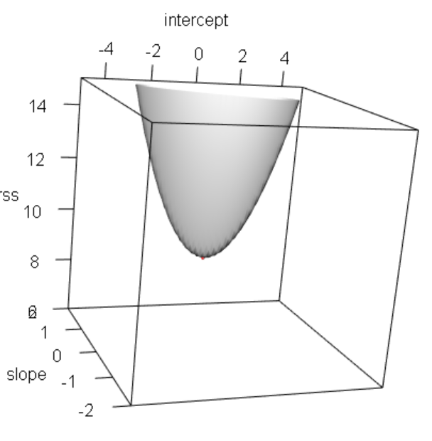

# 3D plot을 이용한 결과 확인 

```R
library(rgl)
RSS <- function(intercept, slope){
  y_i_hat <- c(2, 4, 6, 8) * slope + intercept
  y_i <- c(1, 6, 4, 8)
  sum((y_i - y_i_hat)^2)
}
# vectoriaze
rss <- Vectorize(RSS)

open3d()

# 3D 그래프
persp3d(rss,
        xlim = c(-5, 5),
        ylim = c(-2, 2),
        zlim = c(6, 15),
        n = 100)

rgl.spheres(
  x = 0.0005164763, # 선형회귀 직선 기울기
  y = 0.9499521173, # 절편
  z = RSS(0.0005164763, 0.9499521173),
  r = 0.05,
  color = 'red'
) # 빨간 3차원 구로 최적 해임을 확인

clear3d()

```

### result



