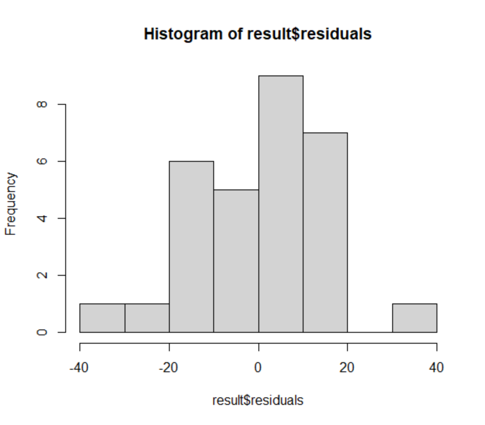

# R에서의 회귀직선 함수 lm() 사용 및 결과 해석

```R
mydata <- read.csv("https://www.theissaclee.com/ko/courses/rstat101/examscore.csv", header = TRUE)


# lm(): linear model 회귀분석은 linear 모델 중 하나입니다.
# lm(회귀식 혹은 모델식, 데이터)

#lm(기말고사 = 기울기 + 중간고사 * 인터셉트 + noise,
#       데이터 = mydata)

#lm(기말고사 = 중간고사
#       데이터 = mydata)

result = lm(final ~ midterm, mydata)

summary(result)
result$coefficients


plot(mydata$midterm, mydata$final, asp = 1,
     xlab = "중간고사", 
     ylab = "기말고사",
     main = "시험점수 산점도")
abline(result$coefficients)
result$residuals # 잔차
summary(result$residuals)
hist(result$residuals)

par(mfrow = c(2,2))
plot(result)

```

## summary(result)

```bash
Call:
lm(formula = final ~ midterm, data = mydata)

Residuals:
    Min      1Q  Median      3Q     Max 
-32.857 -11.175   2.281  10.057  30.866 

Coefficients:
            Estimate Std. Error t value Pr(>|t|)    
(Intercept)  13.8866     8.0195   1.732   0.0943 .  
midterm       0.8967     0.1842   4.868 3.98e-05 ***
---
Signif. codes:  0 ‘***’ 0.001 ‘**’ 0.01 ‘*’ 0.05 ‘.’ 0.1 ‘ ’ 1

Residual standard error: 14.28 on 28 degrees of freedom
Multiple R-squared:  0.4583,	Adjusted R-squared:  0.439 
F-statistic: 23.69 on 1 and 28 DF,  p-value: 3.984e-05

```

## 그래프


## summary(result$residuals)

```bash
   Min. 1st Qu.  Median    Mean 3rd Qu.    Max. 
-32.857 -11.175   2.281   0.000  10.057  30.866 
```

## hist(result$residuals)



