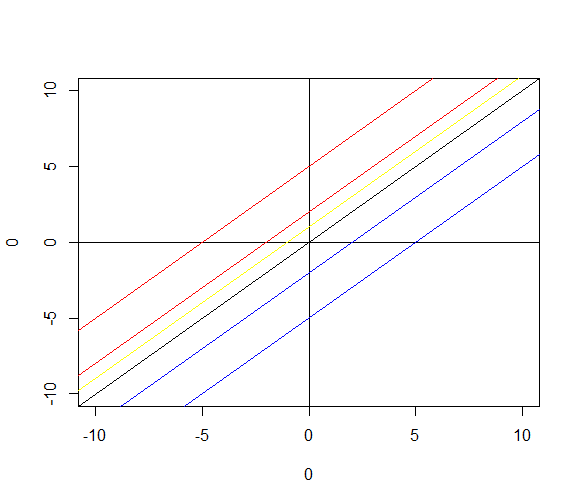
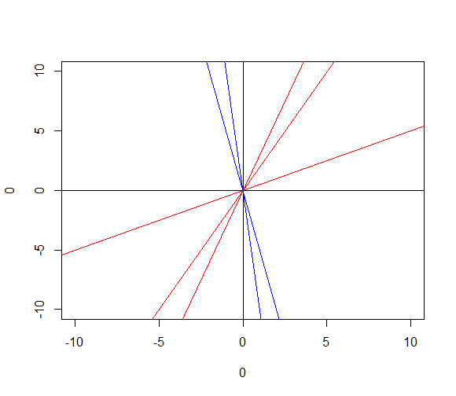
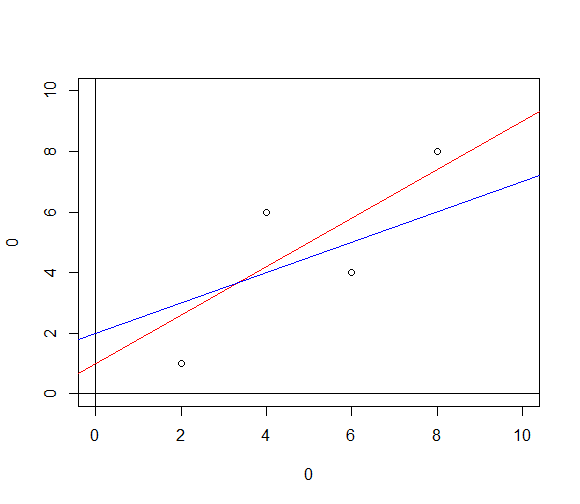

# Regression Analysis

- 회귀 직선 구하기
- `y = a + bx` 
- a는 y절편, b는 기울기

## 기울기와 절편

```R
plot(0, 0, type = "n",
     xlim = c(-10, 10),
     ylim = c(-10, 10))
abline(h = 0)
abline(v = 0)
# abline(a = 절편, b = 기울기)
abline(a = 0, b = 1)

# 절편에 따른 직선 변화
abline(a=1, b=1, col="yellow")
abline(a=2, b=1, col="red")
abline(a=5, b=1, col="red")
abline(a=-2, b=1, col="blue")
abline(a=-5, b=1, col="blue")

# 기울기에 따른 직선 변화
abline(a=0, b=2, col="red")
abline(a=0, b=3, col="red")
abline(a=0, b=0.5, col="red")
abline(a=0, b=-5, col="blue")
abline(a=0, b=-10, col="blue")
```





## 회귀분석을 하는 이유

- 독립 변수 - 입력값이나 원인, 종속 변수에 영향을 주는 변수
- 종속 변수 - 결과물이나 효과, 서로 관계를 갖는 변수들 중에서 관심 대상이 되고 다른 변수에 영향을 받는 변수
- 단순회귀 분석 - 한 종속변수와 이에 영향을 미치는 한 독립변수 간의 관계를 분석

종속 변수가 독립 변수에 의해 종속되어 있다고 해석됨

이유 : 독립변수를 통해 종속 변수를 알고자 할 때 회귀분석을 사용, 어떤 직선이 더 좋은가?



## RSS 잔차제곱합을 최소로 만든다는 의미

### 잔차제곱합

* 데이터와 추정 모델 사이의 불일치를 평가하는 척도
* RSS(**residual sum of squares**) 가 작으면 모델이 데이터를 잘 표현하는 것이다.
* [최소제곱법 (least square method)](http://kanggc.iptime.org/stat/chap12/chap12.pdf) 라고 한다

## R을 이용한 회귀직선 구하기

```R
# RSS = sum((y_i - y_i_hat)^2)1
y_i_hat <- c(2, 4, 6, 8) * 0.5 + 2 # 직선 1
y_i_hat
y_i <- c(1, 6, 4, 8)
sum((y_i - y_i_hat)^2) # 13

y_i_hat <- c(2, 4, 6, 8) * 0.8 + 1 # 직선 2
y_i_hat
y_i <- c(1, 6, 4, 8)
sum((y_i - y_i_hat)^2) # 9.4

RSS <- function(par){
  intercept <- par[1]
  slope <- par[2]
  y_i_hat <- c(2, 4, 6, 8) * slope + intercept
  y_i <- c(1, 6, 4, 8)
  sum((y_i - y_i_hat)^2)
}

RSS(c(2, 0.5))
RSS(c(1, 0.8))
RSS(c(1, 0.8))

# optim 이 계속 반복하여 값을 찾음
result <- optim(par = c(2, 0.5), fn = RSS)
result

abline(a = 0.0005164763, b = 0.9499521173, col="orange")
```

